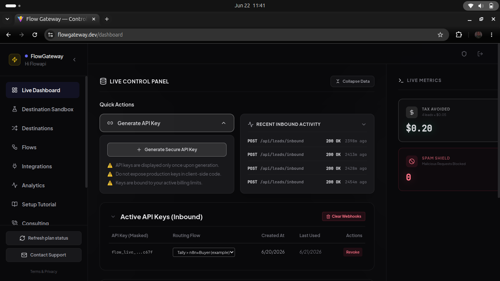
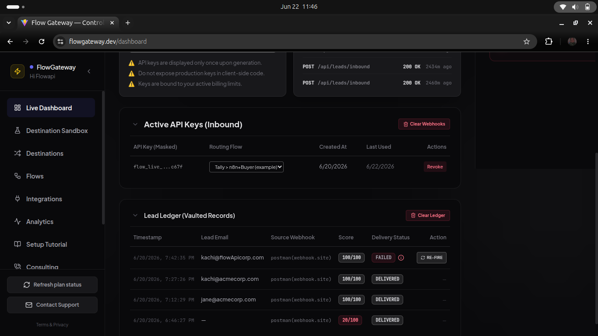
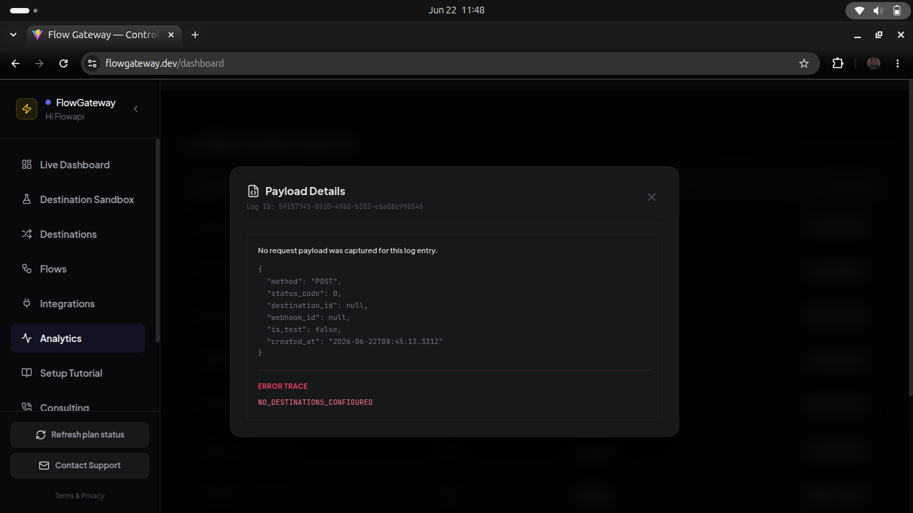

# FlowAPI — Lead Routing Engine

> **Stop chasing stale lists. Route live leads in milliseconds.**

FlowAPI is the enterprise-grade webhook routing engine built for lead brokers and performance marketing agencies. Capture a lead once, deliver it to every buyer instantly — no manual uploads, no spreadsheet hell, no missed conversions.

**Live platform:** [flowgateway.dev](https://flowgateway.dev)

---

## Screenshots

### Live Dashboard
Real-time view of inbound activity, vaulted leads, lead scoring, and delivery status — plus the Tax Avoided and Spam Shield counters showing dollar value saved.



### API Keys, Routing Flows & the Lead Vault
Bind each scoped API key to a routing flow and revoke it in one click — keys are SHA-256 hashed at rest and shown exactly once. Below it, the Lead Vault records every captured lead with its score and delivery status, and lets you re-fire any failed delivery on demand.



### Webhook Traffic Analytics
Every inbound and outbound request is timestamped, status-coded, and inspectable. Click a row to view the raw JSON payload.



---

## The Problem We Solve

Lead brokers spend hours every day doing work that should be instantaneous. A lead comes in from a form, an affiliate, or a CRM — and someone has to manually route it to the right buyer before it goes cold. By the time it lands, it's stale. By the time the buyer works it, the prospect has moved on.

FlowAPI eliminates that gap entirely. Your leads move from capture to your buyer's CRM in under 50ms.

---

## How It Works

```
                 ┌──────────────────────────────────────────┐
Lead Source ───▶ │  FlowAPI Gateway (Express + BullMQ)      │ ───▶ Buyer CRM
 (Tally,         │  ┌──────────┐  ┌─────────┐  ┌──────────┐ │      (GHL,
  Typeform,      │  │  Score & │─▶│  Queue  │─▶│ Dispatch │ │       Salesforce,
  GHL, n8n,      │  │  Vault   │  │ (Redis) │  │  (HTTP)  │ │       custom)
  Facebook)      │  └────┬─────┘  └────┬────┘  └────┬─────┘ │
                 │       │             │            │       │
                 │       ▼             ▼            ▼       │
                 │   Postgres        BullMQ      DNS+SSRF   │
                 │  (ghl_leads)    (retries)      checks    │
                 └──────────────────────────────────────────┘
```

**1. Inbound Capture** — Push any JSON payload to your unique webhook endpoint using your API key. FlowAPI accepts data from any source — GoHighLevel, web forms, affiliate networks, or custom integrations.

**2. The Routing Engine** — Every lead is scored, deduplicated, and checked against each buyer's daily cap before dispatch. The engine enforces your rules automatically, 24/7.

**3. Outbound Delivery** — FlowAPI forwards the payload to your buyer's endpoint using round-robin (first available buyer) or broadcast (all buyers simultaneously) routing. Failed deliveries are automatically retried based on your plan tier.

---

## Key Features

### Smart Lead Routing
- **Round-Robin** — Distribute leads sequentially across your buyer network, respecting each buyer's daily cap
- **Broadcast** — Deliver the same lead to all active destinations simultaneously
- **Daily Caps per Buyer** — Never oversell a campaign. Per-destination limits are enforced atomically by a Redis Lua script — there is no race window in which a buyer can be sold a lead over cap

### Reliability at Every Tier
- **Automatic Retries** — Growth accounts get 3 retry attempts; Enterprise accounts get up to 100 with exponential backoff, so no lead is lost to a momentary downstream outage
- **Delivery Status Tracking** — Every lead carries a live status: `PENDING → DELIVERED / RETRYING / FAILED / CANCELED`
- **Webhook Audit Logs** — Full delivery history with request payloads and response codes, retained based on your plan

### Enterprise-Grade Security
- **SHA-256 Hashed API Keys** — Plaintext keys are never stored; only a cryptographic hash lives in the database
- **Two-Factor Authentication** — TOTP-based 2FA with QR code setup for every account
- **Step-Up OTP Verification** — Sensitive operations (generating new API keys) require a fresh email OTP, with a 72-hour trusted device bypass for convenience
- **DNS Rebinding Protection** — Every outbound dispatch resolves the target hostname and blocks private/internal IP ranges to prevent SSRF attacks
- **SSRF-Safe URL Validation** — Destination URLs are validated against a strict allowlist at save time, rejecting local networks, cloud metadata endpoints, and `.local` domains

### Lead Intelligence
- **Automatic Lead Scoring** — Every inbound lead receives a 0–100 quality score based on email domain, phone completeness, company presence, and name validity — no configuration required
- **Smart Field Extraction** — FlowAPI recursively parses arbitrarily nested CRM payloads, so a `contact.email` and a root-level `email` field are both handled without custom mapping
- **Meta/Facebook Webhook Verification** — Built-in support for the `hub.challenge` handshake, so you can connect Facebook Lead Ads directly without any additional tooling

### Compliance Built In
- **GDPR Right to Erasure** — One API call permanently deletes an account and cascades removal of all associated leads, webhooks, and logs
- **Plan-Gated Log Retention** — Logs are automatically purged nightly: 7 days for free accounts, 30 days for Pro, unlimited for Plus

---

## Pricing

| | **Sandbox** | **Growth** | **Enterprise** |
|---|---|---|---|
| **Price** | Free | $99/mo | $249/mo |
| **Requests/day** | 500 | 10,000 | 100,000 |
| **Destinations** | 1 | Up to 5 | Unlimited |
| **Retry Queue** | None | 3× fixed backoff | 100× exponential backoff |
| **Log Retention** | 7 days | 30 days | Unlimited |
| **Custom Headers** | — | — | Yes |

[Get started free →](https://flowgateway.dev)

---

## Repository Layout

```
flowapi/
├── api-gateway/       # Node.js + Express backend (the main service)
│   ├── routes/        # Express route handlers
│   ├── services/      # WebhookDispatcher, queue, janitor
│   ├── middleware/    # auth, requirePlan, validateRequest, rate limiters
│   ├── db/            # connection.js (auto-migrates schema on boot)
│   └── tests/         # vitest integration tests
├── flow-dashboard/    # React + Vite control panel
│   └── src/
│       ├── pages/     # LandingPage, Dashboard, docs, Legal
│       └── components/
├── authkit-service/   # Minimal separate auth microservice (secondary)
└── docs/              # Screenshots and additional docs
```

---

## Tech Stack

| Layer | Technology |
|---|---|
| API / Backend | Node.js 18+, Express 4 |
| Database | PostgreSQL 16 (via PgBouncer connection pooling) |
| Cache / Rate Limiting | Redis 7 |
| Job Queue | BullMQ |
| Frontend Dashboard | React 18, Vite, Tailwind CSS |
| Validation | Zod |
| Auth | JWT (HttpOnly cookies), bcrypt, speakeasy TOTP |
| Email | Nodemailer / Resend |
| Payments | Stripe |
| Container | Docker + Docker Compose |

---

## Self-Hosting

FlowAPI is fully self-hostable. The repo ships with a Docker Compose file that brings up Postgres, PgBouncer, Redis, and the API gateway in one command.

### Prerequisites
- Node.js ≥ 18
- PostgreSQL 16
- Redis 7
- Docker & Docker Compose (recommended)

### Quickstart

```bash
# 1. Clone the repository
git clone https://github.com/kachirich/flowapi.git
cd flowapi

# 2. Configure the API gateway
cp api-gateway/.env.example api-gateway/.env
# Edit api-gateway/.env — set JWT_SECRET, PGPASSWORD, and any Stripe/email keys

# 3. Start all infrastructure services (Postgres, PgBouncer, Redis) + the gateway
cd api-gateway
docker compose up -d

# 4. Start the frontend dashboard (separate terminal)
cd ../flow-dashboard
npm install
npm run dev
```

The API gateway runs on `http://localhost:3000`. The dashboard dev server runs on `http://localhost:5173`.

The database schema is applied automatically on first startup via `db/connection.js:initializeDatabase()` — no manual migrations required. The same function runs idempotent `CREATE TABLE IF NOT EXISTS` and `ALTER TABLE ADD COLUMN IF NOT EXISTS` statements, so it is safe to re-run on every boot.

### Environment Variables

See [`api-gateway/.env.example`](api-gateway/.env.example) for the full list. The minimum required to boot:

```env
# Database
PGHOST=localhost
PGPORT=6432            # PgBouncer port; use 5432 to bypass
PGDATABASE=flow_gateway
PGUSER=postgres
PGPASSWORD=<your-password>

# Cache / queue
REDIS_URL=redis://127.0.0.1:6379

# Security
JWT_SECRET=<long-random-string-at-least-32-chars>
CORS_ORIGIN=http://localhost:5173,https://yourdomain.com

# Optional — required only for the features below
STRIPE_SECRET_KEY=sk_live_...            # billing
STRIPE_WEBHOOK_SECRET=whsec_...          # billing webhooks
RESEND_API_KEY=re_...                    # email OTPs / notifications
EMAIL_FROM=no-reply@yourdomain.com
```

The frontend reads `VITE_API_BASE_URL` (defaults to `http://localhost:3000`).

### Running Without Docker

If you'd rather run the stack natively:

```bash
# Postgres + Redis must be available locally
cd api-gateway
npm install
npm run dev        # auto-restarts on file changes

# in another terminal
cd flow-dashboard
npm install
npm run dev
```

### Production Deployment Notes

- Put the API gateway behind a TLS terminator (Caddy, nginx, or your cloud load balancer). The app does not terminate TLS itself.
- Set `NODE_ENV=production`. This re-enables all rate limiters (they are auto-skipped in development) and turns off verbose error responses.
- Provision Redis with `maxmemory-policy noeviction` so rate-limit and cap state never disappears under memory pressure.
- The Janitor service runs nightly at midnight UTC and purges `webhook_logs` per the plan-gated retention policy. Make sure your container is not killed before midnight if you operate at low scale.
- Use PgBouncer in transaction pooling mode (the bundled compose file does this) to handle bursty webhook traffic without exhausting Postgres connections.

---

## API Reference (essentials)

All routes return `{ success: boolean, message?: string, error?: string, data?: object }`.

### Authentication
Two methods are supported. Pick one per request:

- **JWT cookie** — `Cookie: jwt=<token>` (issued by `POST /api/auth/login`, HttpOnly, SameSite=Strict)
- **API key** — `x-api-key: flow_live_xxx` (created from the dashboard or `POST /api/keys`)

### Core endpoints

| Method | Path | Description |
|---|---|---|
| `POST` | `/api/catch/:webhook_id` | **Inbound lead ingress.** Public endpoint identified by the webhook UUID. |
| `POST` | `/api/leads/inbound` | Alternate ingress that authenticates with `x-api-key`. |
| `GET`  | `/api/leads` | List vaulted leads for the authenticated account. |
| `POST` | `/api/destinations` | Create a new downstream buyer destination. |
| `GET`  | `/api/destinations` | List destinations. |
| `POST` | `/api/keys` | Generate a new API key (requires step-up OTP). |
| `DELETE` | `/api/keys/:id` | Revoke an API key. |
| `GET`  | `/api/logs` | Webhook delivery audit log. |
| `POST` | `/api/auth/login` | Login with email + password; sets the JWT cookie. |
| `GET`  | `/api/auth/me` | Rehydrate the session from the cookie. |

### Routing your first lead

```bash
# 1. Send a lead at your unique webhook URL
curl -X POST https://flowgateway.dev/api/catch/<your-webhook-id> \
  -H "Content-Type: application/json" \
  -d '{
    "first_name": "Jane",
    "last_name":  "Smith",
    "email":      "jane@acmecorp.com",
    "phone":      "+1-555-0100",
    "company":    "Acme Corp"
  }'

# Response — returned the instant the job is queued
# {"success":true,"lead_id":"…","delivery_status":"PENDING"}
```

FlowAPI scores, stores, and dispatches the lead — and returns `200` before the buyer even knows it's coming.

---

## Development

```bash
# Backend tests (require running Postgres + Redis)
cd api-gateway
npm test                  # all tests
npm run test:watch        # watch mode
npx vitest run tests/integration.test.js --reporter verbose   # single file

# Frontend
cd flow-dashboard
npm run dev               # Vite dev server
npm run build             # production bundle
npm run lint              # ESLint
```

### Architecture cheatsheet

- `app.js` exports the Express app **without** calling `listen()` so Supertest can mount it.
- All rate limiters use `RedisStore` and are skipped in development. They prefer `req.user.id` over IP via `globalKeyGenerator`.
- `WebhookDispatcher.dispatchLead()` is the heart of outbound delivery. It branches on `round_robin` vs `broadcast` and enforces caps with the `CHECK_CAP_LUA` Redis script.
- The Janitor (`services/janitor.service.js`) cron-purges `webhook_logs` at midnight.
- Sensitive endpoints require **step-up OTP**, which mints a 72h trusted-device JWT stored in the `x-trusted-device-token` header.

See [`CLAUDE.md`](CLAUDE.md) for the full internal architecture notes.

---

## Troubleshooting

**Schema didn't apply / tables missing on first boot**
The schema runs from `db/connection.js:initializeDatabase()` on every startup. Check the container logs for the connection error — usually it's a wrong `PGHOST` or `PGPASSWORD` or PgBouncer pointing at the wrong upstream.

**Rate limiter blocking everything in dev**
You're probably setting `NODE_ENV=production` locally. Limiters auto-skip when `NODE_ENV !== 'production'` AND the request comes from localhost.

**`ECONNREFUSED 127.0.0.1:6379` (Redis)**
Set `REDIS_URL` in `.env`. The Janitor, BullMQ, and rate limiters all need Redis — the gateway will exit on boot if it can't reach it.

**Dispatches all returning `BLOCKED_INTERNAL_HOSTNAME`**
The DNS rebinding check is doing its job: the destination URL resolved to a private IP. For local testing against `localhost` buyers, include `flow_api_test: true` in the payload to bypass the check.

**`PERMISSION_DENIED` from `requirePlan`**
The authenticated user's `plan_type` is below the route's required tier. Inspect `users.plan_type` in Postgres or clear the cached value: `DEL user:<id>:plan` in Redis.

**Emails not sending in dev**
OTP and notification emails are no-ops without `RESEND_API_KEY` (or your SMTP config). For local testing the OTP code is logged to stdout — grep the gateway logs for the 6-digit code.

---

## Contributing

PRs welcome. The repo's commit style is conventional-ish — feel free to mirror what's on `main`. Please:

1. Open an issue first for anything larger than a bugfix
2. Make sure `npm test` passes in `api-gateway/` against a real Postgres + Redis
3. Run `npm run lint` in `flow-dashboard/`
4. Don't introduce schema changes outside `db/connection.js` — that file owns the entire schema

---

## License

Released under the [MIT License](LICENSE). © 2026 FlowAPI.
